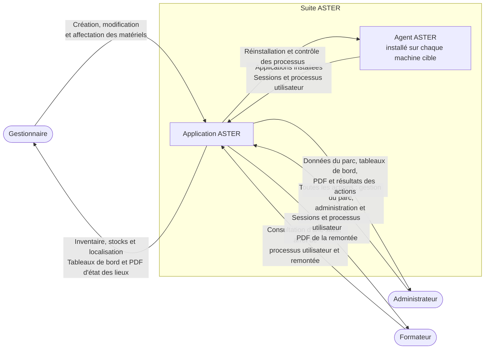

# Diagramme de contexte de l'application ASTER

```mermaid
flowchart LR
    gestionnaire(["Gestionnaire"])
    administrateur(["Administrateur"])
    formateur(["Formateur"])
    subgraph suite["Suite ASTER"]
        aster["Application ASTER"]
        agent["Agent ASTER<br/>installé sur chaque machine cible"]
    end

    gestionnaire -->|"Création, modification<br/>et affectation des matériels"| aster
    aster -->|"Inventaire, stocks et localisation<br/>Tableaux de bord et PDF d'état des lieux"| gestionnaire

    administrateur -->|"Toutes les actions : gestion du parc,<br/>administration et supervision"| aster
    aster -->|"Données du parc, tableaux de bord,<br/>PDF et résultats des actions"| administrateur

    formateur -->|"Consultation d'une salle, arrêt de<br/>processus utilisateur et remontée"| aster
    aster -->|"Sessions et processus utilisateur<br/>PDF de la remontée"| formateur

    agent -->|"Applications installées<br/>Sessions et processus utilisateur"| aster
    aster -->|"Réinstallation et contrôle des processus"| agent
```
