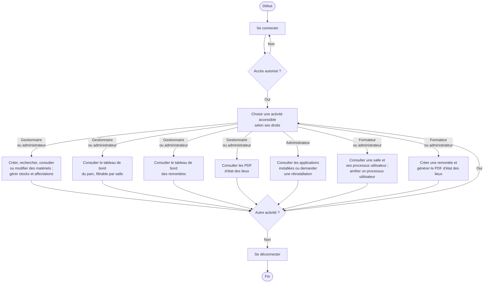
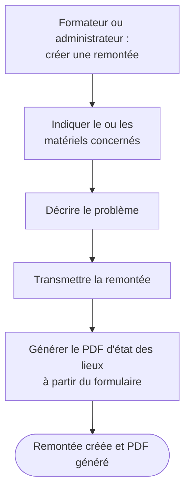
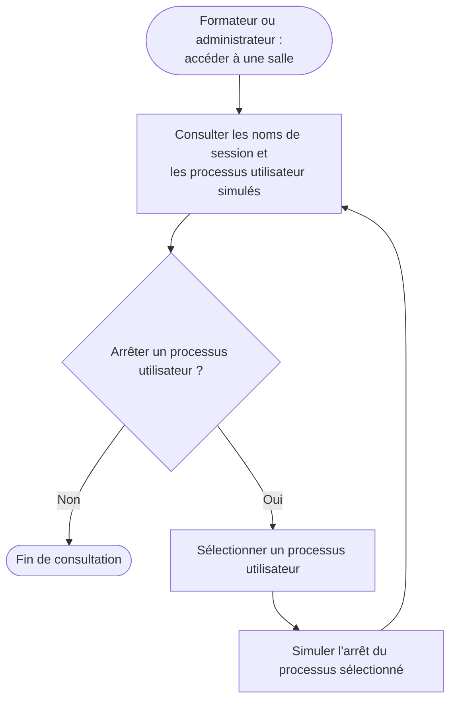

# Diagrammes d'activité de l'application ASTER

## Parcours général

```mermaid
flowchart TD
    debut(["Début"]) --> connexion["Se connecter"]
    connexion --> acces{"Accès autorisé ?"}
    acces -->|"Non"| connexion
    acces -->|"Oui"| choix["Choisir une activité accessible<br/>selon ses droits"]

    choix -->|"Gestionnaire<br/>ou administrateur"| parc["Créer, rechercher, consulter<br/>ou modifier des matériels ;<br/>gérer stocks et affectations"]
    choix -->|"Gestionnaire<br/>ou administrateur"| bordParc["Consulter le tableau de bord<br/>du parc, filtrable par salle"]
    choix -->|"Gestionnaire<br/>ou administrateur"| bordRemontees["Consulter le tableau de bord<br/>des remontées"]
    choix -->|"Gestionnaire<br/>ou administrateur"| documents["Consulter les PDF<br/>d'état des lieux"]
    choix -->|"Administrateur"| administration["Consulter les applications<br/>installées ou demander<br/>une réinstallation"]
    choix -->|"Formateur<br/>ou administrateur"| supervision["Consulter une salle et<br/>ses processus utilisateur ;<br/>arrêter un processus utilisateur"]
    choix -->|"Formateur<br/>ou administrateur"| remontee["Créer une remontée et<br/>générer le PDF d'état des lieux"]

    parc --> suite{"Autre activité ?"}
    bordParc --> suite
    bordRemontees --> suite
    documents --> suite
    administration --> suite
    supervision --> suite
    remontee --> suite
    suite -->|"Oui"| choix
    suite -->|"Non"| deconnexion["Se déconnecter"]
    deconnexion --> fin(["Fin"])
```

## Création d'une remontée

```mermaid
flowchart TD
    debut["Formateur ou administrateur :<br/>créer une remontée"] --> materiels["Indiquer le ou les<br/>matériels concernés"]
    materiels --> probleme["Décrire le problème"]
    probleme --> transmettre["Transmettre la remontée"]
    transmettre --> pdf["Générer le PDF d'état des lieux<br/>à partir du formulaire"]
    pdf --> fin(["Remontée créée et PDF généré"])
```

## Supervision des processus — simulation de démonstration

```mermaid
flowchart TD
    debut(["Formateur ou administrateur :<br/>accéder à une salle"]) --> consulter["Consulter les noms de session et<br/>les processus utilisateur simulés"]
    consulter --> arret{"Arrêter un processus utilisateur ?"}
    arret -->|"Non"| fin(["Fin de consultation"])
    arret -->|"Oui"| selection["Sélectionner un processus utilisateur"]
    selection --> action["Simuler l'arrêt du processus sélectionné"]
    action --> consulter
```
