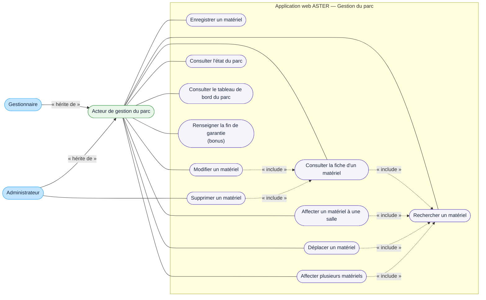

# DCU — Gérer le parc

```mermaid
flowchart LR
    acteurGestion(["Acteur de gestion du parc"])
    gestionnaire(["Gestionnaire"])
    administrateur(["Administrateur"])

    gestionnaire -->|« hérite de »| acteurGestion
    administrateur -->|« hérite de »| acteurGestion

    subgraph aster["Application web ASTER — Gestion du parc"]
        direction TB
        rechercher(["Rechercher un matériel"])
        enregistrer(["Enregistrer un matériel"])
        consulter(["Consulter la fiche d'un matériel"])
        modifier(["Modifier un matériel"])
        supprimer(["Supprimer un matériel"])
        affecter(["Affecter un matériel à une salle"])
        deplacer(["Déplacer un matériel"])
        affecterGroupe(["Affecter plusieurs matériels"])
        consulterParc(["Consulter l'état du parc"])
        consulterTableau(["Consulter le tableau de bord du parc"])
        renseignerGarantie(["Renseigner la fin de garantie<br/>(bonus)"])
    end

    acteurGestion --- rechercher
    acteurGestion --- enregistrer
    acteurGestion --- consulter
    acteurGestion --- modifier
    acteurGestion --- affecter
    acteurGestion --- deplacer
    acteurGestion --- affecterGroupe
    acteurGestion --- consulterParc
    acteurGestion --- consulterTableau
    acteurGestion --- renseignerGarantie
    administrateur --- supprimer

    consulter -.->|« include »| rechercher
    modifier -.->|« include »| consulter
    supprimer -.->|« include »| consulter
    affecter -.->|« include »| rechercher
    deplacer -.->|« include »| rechercher
    affecterGroupe -.->|« include »| rechercher

    classDef acteur fill:#C2E5FF,stroke:#3DADFF,color:#17243B
    classDef acteurGeneral fill:#E8F5E9,stroke:#3E9B4B,color:#17243B
    classDef cas fill:#F6F4FB,stroke:#6954C0,color:#17243B
    class gestionnaire,administrateur acteur
    class acteurGestion acteurGeneral
    class rechercher,enregistrer,consulter,modifier,supprimer,affecter,deplacer,affecterGroupe,consulterParc,consulterTableau,renseignerGarantie cas
```
