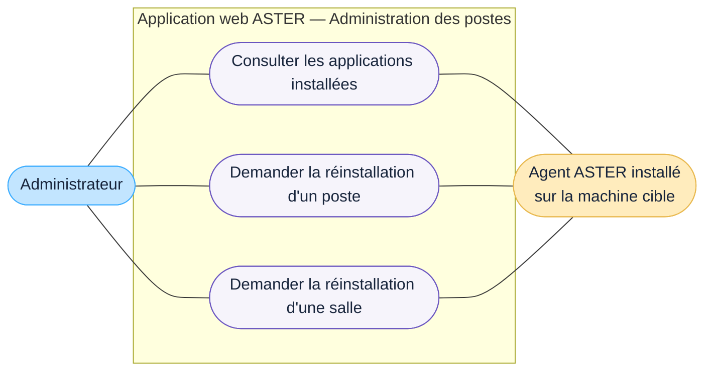

# DCU — Administrer les postes

```mermaid
flowchart LR
    administrateur(["Administrateur"])

    subgraph aster["Application web ASTER — Administration des postes"]
        direction TB
        consulterApplications(["Consulter les applications installées"])
        demanderPoste(["Demander la réinstallation d'un poste"])
        demanderSalle(["Demander la réinstallation d'une salle"])
    end

    agentAster(["Agent ASTER installé<br/>sur la machine cible"])

    administrateur --- consulterApplications
    administrateur --- demanderPoste
    administrateur --- demanderSalle

    consulterApplications --- agentAster
    demanderPoste --- agentAster
    demanderSalle --- agentAster

    classDef acteur fill:#C2E5FF,stroke:#3DADFF,color:#17243B
    classDef acteurSecondaire fill:#FFECBD,stroke:#E8B84E,color:#17243B
    classDef cas fill:#F6F4FB,stroke:#6954C0,color:#17243B
    class administrateur acteur
    class agentAster acteurSecondaire
    class consulterApplications,demanderPoste,demanderSalle cas
```
