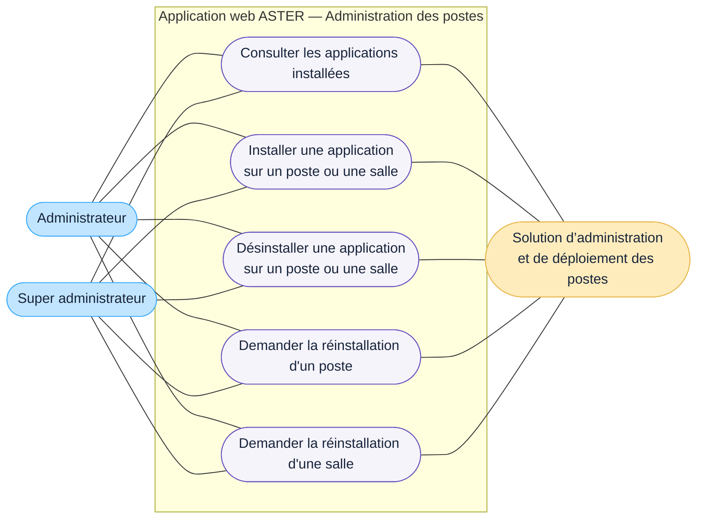

# DCU — Administrer les postes

```mermaid
flowchart LR
    administrateur(["Administrateur"])
    superAdministrateur(["Super administrateur"])

    subgraph aster["Application web ASTER — Administration des postes"]
        direction TB
        consulterApplications(["Consulter les applications installées"])
        installerApplication(["Installer une application<br/>sur un poste ou une salle"])
        desinstallerApplication(["Désinstaller une application<br/>sur un poste ou une salle"])
        demanderPoste(["Demander la réinstallation d'un poste"])
        demanderSalle(["Demander la réinstallation d'une salle"])
    end

    administrationDistante(["Solution d’administration<br/>et de déploiement des postes"])

    administrateur --- consulterApplications
    administrateur --- installerApplication
    administrateur --- desinstallerApplication
    administrateur --- demanderPoste
    administrateur --- demanderSalle
    superAdministrateur --- consulterApplications
    superAdministrateur --- installerApplication
    superAdministrateur --- desinstallerApplication
    superAdministrateur --- demanderPoste
    superAdministrateur --- demanderSalle

    consulterApplications --- administrationDistante
    installerApplication --- administrationDistante
    desinstallerApplication --- administrationDistante
    demanderPoste --- administrationDistante
    demanderSalle --- administrationDistante

    classDef acteur fill:#C2E5FF,stroke:#3DADFF,color:#17243B
    classDef acteurSecondaire fill:#FFECBD,stroke:#E8B84E,color:#17243B
    classDef cas fill:#F6F4FB,stroke:#6954C0,color:#17243B
    class administrateur,superAdministrateur acteur
    class administrationDistante acteurSecondaire
    class consulterApplications,installerApplication,desinstallerApplication,demanderPoste,demanderSalle cas
```
