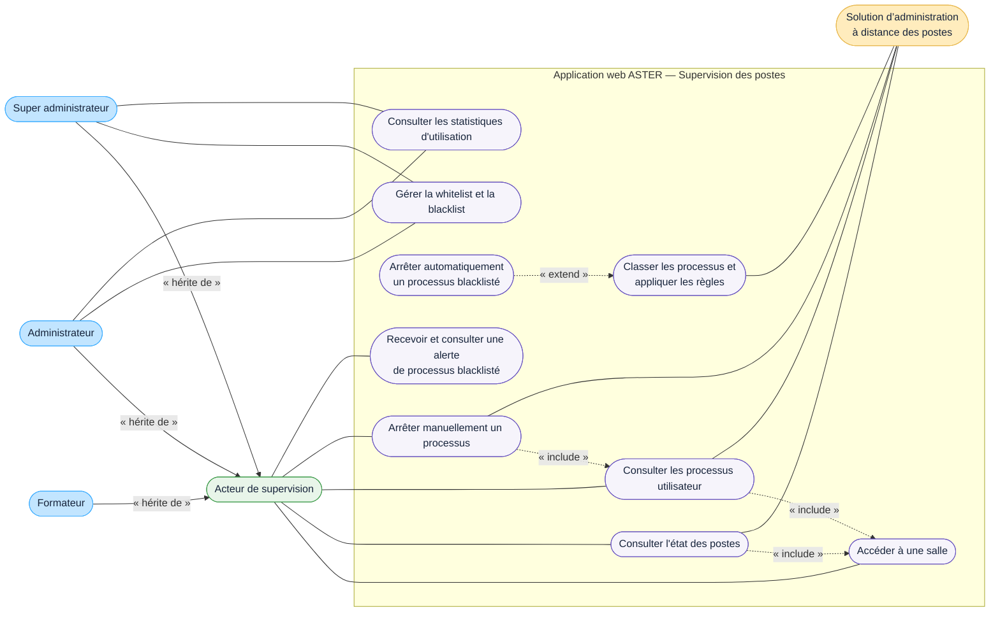

# DCU — Superviser les postes

```mermaid
flowchart LR
    acteurSupervision(["Acteur de supervision"])
    formateur(["Formateur"])
    administrateur(["Administrateur"])
    superAdministrateur(["Super administrateur"])

    formateur -->|« hérite de »| acteurSupervision
    administrateur -->|« hérite de »| acteurSupervision
    superAdministrateur -->|« hérite de »| acteurSupervision

    subgraph aster["Application web ASTER — Supervision des postes"]
        direction TB
        accederSalle(["Accéder à une salle"])
        consulterEtat(["Consulter l'état des postes"])
        consulterProcessus(["Consulter les processus utilisateur"])
        arreterProcessus(["Arrêter manuellement un processus"])
        gererListes(["Gérer la whitelist et la blacklist"])
        appliquerRegles(["Classer les processus et<br/>appliquer les règles"])
        arreterInterdit(["Arrêter automatiquement<br/>un processus blacklisté"])
        consulterAlertes(["Recevoir et consulter une alerte<br/>de processus blacklisté"])
        consulterStatistiques(["Consulter les statistiques d'utilisation"])
    end

    administrationDistante(["Solution d’administration<br/>à distance des postes"])

    acteurSupervision --- accederSalle
    acteurSupervision --- consulterEtat
    acteurSupervision --- consulterProcessus
    acteurSupervision --- arreterProcessus
    acteurSupervision --- consulterAlertes
    administrateur --- gererListes
    administrateur --- consulterStatistiques
    superAdministrateur --- gererListes
    superAdministrateur --- consulterStatistiques

    consulterEtat -.->|« include »| accederSalle
    consulterProcessus -.->|« include »| accederSalle
    arreterProcessus -.->|« include »| consulterProcessus
    arreterInterdit -.->|« extend »| appliquerRegles

    consulterEtat --- administrationDistante
    consulterProcessus --- administrationDistante
    arreterProcessus --- administrationDistante
    appliquerRegles --- administrationDistante

    classDef acteur fill:#C2E5FF,stroke:#3DADFF,color:#17243B
    classDef acteurGeneral fill:#E8F5E9,stroke:#3E9B4B,color:#17243B
    classDef acteurSecondaire fill:#FFECBD,stroke:#E8B84E,color:#17243B
    classDef cas fill:#F6F4FB,stroke:#6954C0,color:#17243B
    class formateur,administrateur,superAdministrateur acteur
    class acteurSupervision acteurGeneral
    class administrationDistante acteurSecondaire
    class accederSalle,consulterEtat,consulterProcessus,arreterProcessus,gererListes,appliquerRegles,arreterInterdit,consulterAlertes,consulterStatistiques cas
```
