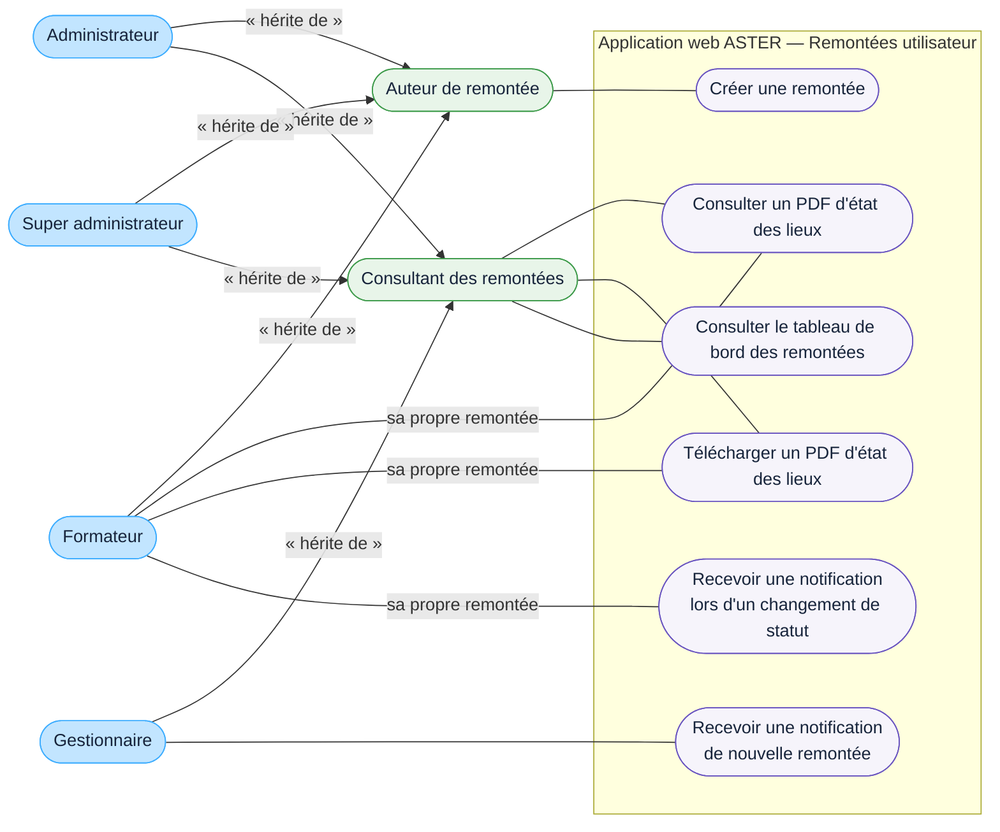

# DCU — Créer une remontée et consulter son état des lieux

```mermaid
flowchart LR
    auteurRemontee(["Auteur de remontée"])
    consultantRemontees(["Consultant des remontées"])
    formateur(["Formateur"])
    gestionnaire(["Gestionnaire"])
    administrateur(["Administrateur"])
    superAdministrateur(["Super administrateur"])

    formateur -->|« hérite de »| auteurRemontee
    administrateur -->|« hérite de »| auteurRemontee
    gestionnaire -->|« hérite de »| consultantRemontees
    administrateur -->|« hérite de »| consultantRemontees
    superAdministrateur -->|« hérite de »| auteurRemontee
    superAdministrateur -->|« hérite de »| consultantRemontees

    subgraph aster["Application web ASTER — Remontées utilisateur"]
        direction TB
        creerRemontee(["Créer une remontée"])
        consulterPdf(["Consulter un PDF d'état des lieux"])
        telechargerPdf(["Télécharger un PDF d'état des lieux"])
        consulterTableau(["Consulter le tableau de bord des remontées"])
        recevoirNotification(["Recevoir une notification<br/>lors d'un changement de statut"])
        recevoirNouvelleRemontee(["Recevoir une notification<br/>de nouvelle remontée"])
    end

    auteurRemontee --- creerRemontee
    consultantRemontees --- consulterPdf
    consultantRemontees --- telechargerPdf
    consultantRemontees --- consulterTableau
    formateur ---|sa propre remontée| consulterPdf
    formateur ---|sa propre remontée| telechargerPdf
    formateur ---|sa propre remontée| recevoirNotification
    gestionnaire --- recevoirNouvelleRemontee

    classDef acteur fill:#C2E5FF,stroke:#3DADFF,color:#17243B
    classDef acteurAbstrait fill:#E8F5E9,stroke:#3E9B4B,color:#17243B
    classDef cas fill:#F6F4FB,stroke:#6954C0,color:#17243B
    class formateur,gestionnaire,administrateur,superAdministrateur acteur
    class auteurRemontee,consultantRemontees acteurAbstrait
    class creerRemontee,consulterPdf,telechargerPdf,consulterTableau,recevoirNotification,recevoirNouvelleRemontee cas
```
