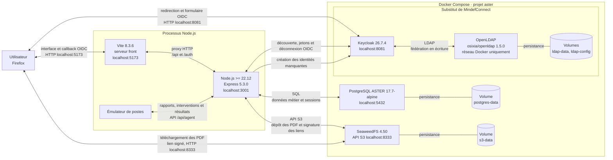
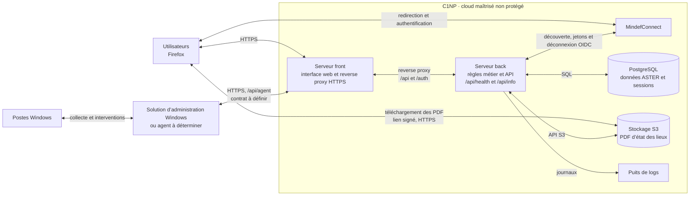

# Diagrammes d’architecture

## Architecture réelle

```mermaid
flowchart LR
    U[Utilisateur<br/>Firefox]

    subgraph APP[Processus Node.js]
        V[Vite 8.3.6<br/>serveur front<br/>localhost:5173]
        E[Node.js >= 22.12<br/>Express 5.3.0<br/>localhost:3001]
        A[Émulateur de postes]
    end

    subgraph DOCKER[Docker Compose · projet aster]
        subgraph MDC[Substitut de MindefConnect]
            K[Keycloak 26.7.4<br/>localhost:8081]
            L[OpenLDAP<br/>osixia/openldap 1.5.0<br/>réseau Docker uniquement]
            VL[(Volumes<br/>ldap-data, ldap-config)]
        end

        PA[PostgreSQL ASTER 17.7-alpine<br/>localhost:5432]
        VA[(Volume<br/>postgres-data)]
        S[SeaweedFS 4.50<br/>API S3 localhost:8333]
        VS[(Volume<br/>s3-data)]
    end

    U <-->|interface et callback OIDC<br/>HTTP localhost:5173| V
    V <-->|proxy HTTP<br/>/api et /auth| E
    U <-->|redirection et formulaire OIDC<br/>HTTP localhost:8081| K
    E <-->|découverte, jetons et déconnexion OIDC| K
    E -->|création des identités manquantes| K
    K <-->|LDAP<br/>fédération en écriture| L
    L ---|persistance| VL
    A <-->|rapports, interventions et résultats<br/>API /api/agent| E
    E <-->|SQL<br/>données métier et sessions| PA
    PA ---|persistance| VA
    E <-->|API S3<br/>dépôt des PDF et signature des liens| S
    U <-->|téléchargement des PDF<br/>lien signé, HTTP localhost:8333| S
    S ---|persistance| VS
```

## Architecture cible

```mermaid
flowchart LR
    U[Utilisateurs<br/>Firefox]
    W[Postes Windows]

    subgraph C1NP[C1NP · cloud maîtrisé non protégé]
        F[Serveur front<br/>interface web et reverse proxy HTTPS]
        B[Serveur back<br/>règles métier et API<br/>/api/health et /api/info]
        M[MindefConnect]
        PG[(PostgreSQL<br/>données ASTER et sessions)]
        S3[(Stockage S3<br/>PDF d’état des lieux)]
        LOG[Puits de logs]
    end

    AW[Solution d’administration Windows<br/>ou agent à déterminer]

    U <-->|HTTPS| F
    F <-->|reverse proxy<br/>/api et /auth| B
    U <-->|redirection et authentification| M
    B <-->|découverte, jetons et déconnexion OIDC| M
    U <-->|téléchargement des PDF<br/>lien signé, HTTPS| S3
    B <-->|SQL| PG
    B <-->|API S3| S3
    B -->|journaux| LOG
    W <-->|collecte et interventions| AW
    AW <-->|HTTPS, /api/agent<br/>contrat à définir| F
```
