# Diagrammes d’activité des cas d’utilisation ORION

<!-- version:debut : généré par versions.py, ne pas modifier à la main -->
| Version | Mise à jour | Destination | Dernière évolution | Historique |
| --- | --- | --- | --- | --- |
| 2.1 | 16/11/2026 | Production destinée à la remise | Adopter la numérotation locale du dossier ; Actualiser les liens après la renumérotation | [3 versions](../../../archive/README.md#08-diagrammes-activite-cas-utilisation) |
<!-- version:fin -->

## 1. Se connecter par MindefConnect

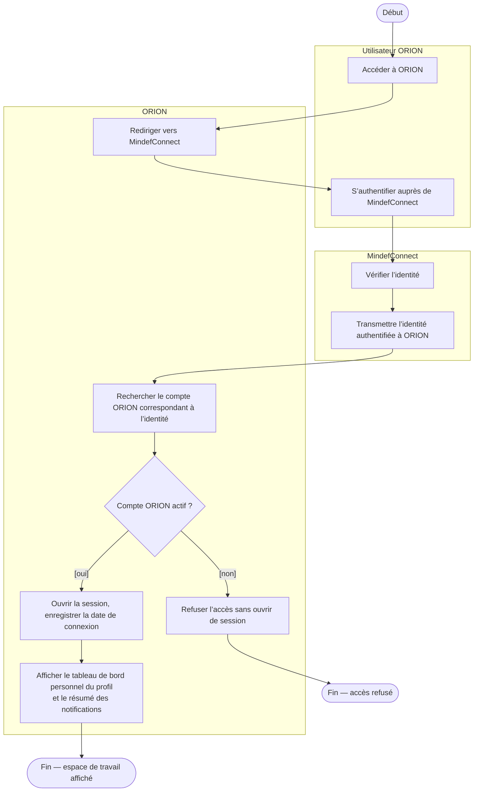
```mermaid
flowchart TD
    debut(["Début"])
    fin(["Fin — espace de travail affiché"])
    finRefus(["Fin — accès refusé"])

    subgraph UTILISATEUR["Utilisateur ORION"]
        acceder["Accéder à ORION"]
        authentifier["S’authentifier auprès de MindefConnect"]
    end

    subgraph IDP["MindefConnect"]
        verifier["Vérifier l’identité"]
        transmettre["Transmettre l’identité authentifiée à ORION"]
    end

    subgraph SYSTEME["ORION"]
        rediriger["Rediriger vers MindefConnect"]
        rapprocher["Rechercher le compte ORION correspondant à l’identité"]
        actif{"Compte ORION actif ?"}
        refuser["Refuser l’accès sans ouvrir de session"]
        session["Ouvrir la session, enregistrer la date de connexion"]
        afficher["Afficher le tableau de bord personnel du profil<br/>et le résumé des notifications"]
    end

    debut --> acceder --> rediriger --> authentifier --> verifier --> transmettre --> rapprocher --> actif
    actif -->|"[non]"| refuser --> finRefus
    actif -->|"[oui]"| session --> afficher --> fin
```

## 2. Enregistrer ou modifier un matériel

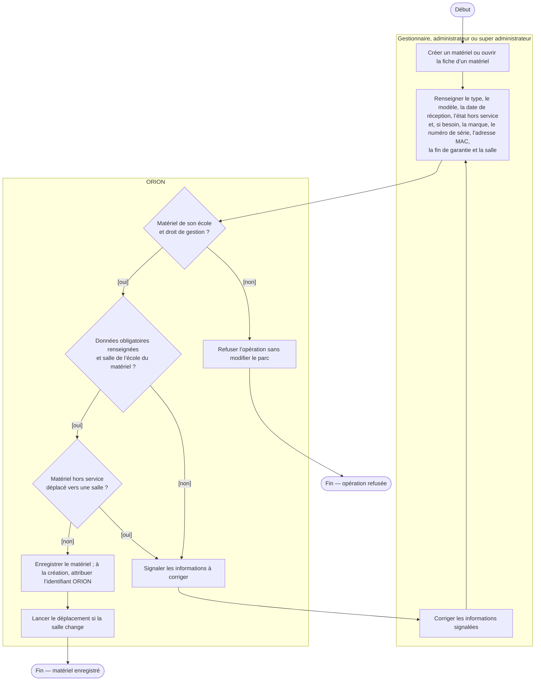
```mermaid
flowchart TD
    debut(["Début"])
    fin(["Fin — matériel enregistré"])
    finRefus(["Fin — opération refusée"])

    subgraph ACTEUR["Gestionnaire, administrateur ou super administrateur"]
        choisir["Créer un matériel ou ouvrir la fiche d’un matériel"]
        saisir["Renseigner le type, le modèle, la date de réception, l’état hors service<br/>et, si besoin, la marque, le numéro de série, l’adresse MAC,<br/>la fin de garantie et la salle"]
        corriger["Corriger les informations signalées"]
    end

    subgraph SYSTEME["ORION"]
        controleDroit{"Matériel de son école<br/>et droit de gestion ?"}
        controleDonnees{"Données obligatoires renseignées<br/>et salle de l’école du matériel ?"}
        controleHs{"Matériel hors service<br/>déplacé vers une salle ?"}
        signaler["Signaler les informations à corriger"]
        refuser["Refuser l’opération sans modifier le parc"]
        enregistrer["Enregistrer le matériel ; à la création, attribuer l’identifiant ORION"]
        deplacement["Lancer le déplacement si la salle change"]
    end

    debut --> choisir --> saisir --> controleDroit
    controleDroit -->|"[non]"| refuser --> finRefus
    controleDroit -->|"[oui]"| controleDonnees
    controleDonnees -->|"[non]"| signaler --> corriger --> saisir
    controleDonnees -->|"[oui]"| controleHs
    controleHs -->|"[oui]"| signaler
    controleHs -->|"[non]"| enregistrer --> deplacement --> fin
```

## 3. Importer de nouveaux matériels en JSON

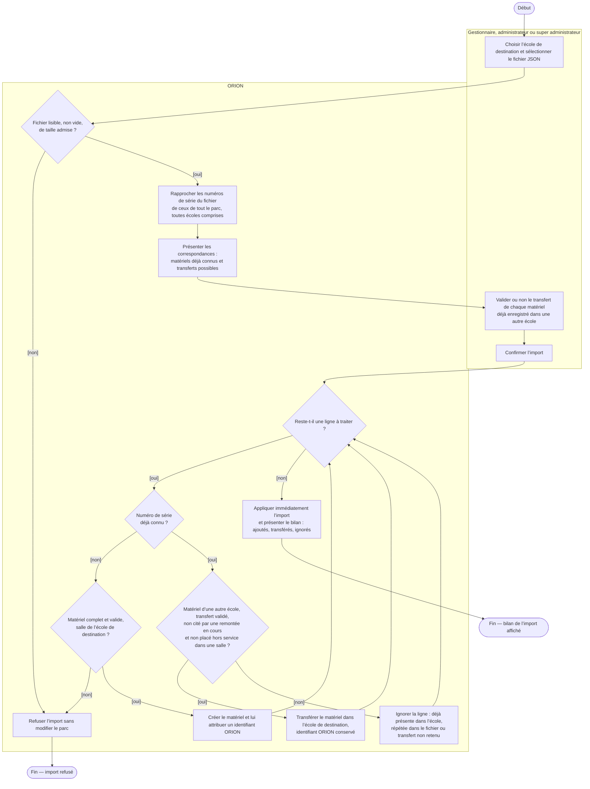
```mermaid
flowchart TD
    debut(["Début"])
    fin(["Fin — bilan de l’import affiché"])
    finRefus(["Fin — import refusé"])

    subgraph ACTEUR["Gestionnaire, administrateur ou super administrateur"]
        selectionner["Choisir l’école de destination et sélectionner le fichier JSON"]
        valider["Valider ou non le transfert de chaque matériel<br/>déjà enregistré dans une autre école"]
        confirmer["Confirmer l’import"]
    end

    subgraph SYSTEME["ORION"]
        lire{"Fichier lisible, non vide,<br/>de taille admise ?"}
        rapprocher["Rapprocher les numéros de série du fichier<br/>de ceux de tout le parc, toutes écoles comprises"]
        presenter["Présenter les correspondances :<br/>matériels déjà connus et transferts possibles"]
        ligne{"Reste-t-il une ligne à traiter ?"}
        connu{"Numéro de série<br/>déjà connu ?"}
        controleLigne{"Matériel complet et valide,<br/>salle de l’école de destination ?"}
        creer["Créer le matériel et lui attribuer un identifiant ORION"]
        autreEcole{"Matériel d’une autre école, transfert validé,<br/>non cité par une remontée en cours<br/>et non placé hors service dans une salle ?"}
        transferer["Transférer le matériel dans l’école de destination,<br/>identifiant ORION conservé"]
        ignorer["Ignorer la ligne : déjà présente dans l’école,<br/>répétée dans le fichier ou transfert non retenu"]
        refuser["Refuser l’import sans modifier le parc"]
        bilan["Appliquer immédiatement l’import<br/>et présenter le bilan : ajoutés, transférés, ignorés"]
    end

    debut --> selectionner --> lire
    lire -->|"[non]"| refuser --> finRefus
    lire -->|"[oui]"| rapprocher --> presenter --> valider --> confirmer --> ligne
    ligne -->|"[oui]"| connu
    connu -->|"[non]"| controleLigne
    controleLigne -->|"[non]"| refuser
    controleLigne -->|"[oui]"| creer --> ligne
    connu -->|"[oui]"| autreEcole
    autreEcole -->|"[oui]"| transferer --> ligne
    autreEcole -->|"[non]"| ignorer --> ligne
    ligne -->|"[non]"| bilan --> fin
```

## 4. Affecter un ou plusieurs matériels à une salle ou au stock

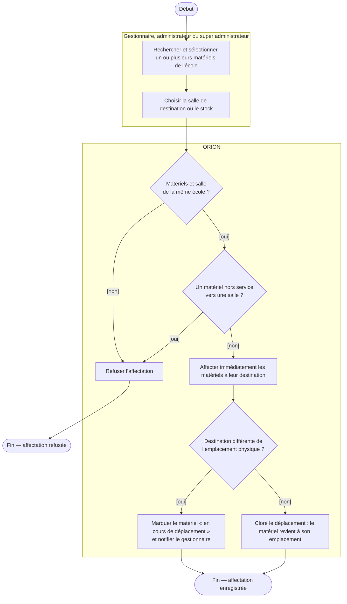
```mermaid
flowchart TD
    debut(["Début"])
    fin(["Fin — affectation enregistrée"])
    finRefus(["Fin — affectation refusée"])

    subgraph ACTEUR["Gestionnaire, administrateur ou super administrateur"]
        rechercher["Rechercher et sélectionner un ou plusieurs matériels de l’école"]
        destination["Choisir la salle de destination ou le stock"]
    end

    subgraph SYSTEME["ORION"]
        controle{"Matériels et salle<br/>de la même école ?"}
        hs{"Un matériel hors service<br/>vers une salle ?"}
        refuser["Refuser l’affectation"]
        affecter["Affecter immédiatement les matériels à leur destination"]
        physique{"Destination différente de<br/>l’emplacement physique ?"}
        lancer["Marquer le matériel « en cours de déplacement »<br/>et notifier le gestionnaire"]
        retour["Clore le déplacement : le matériel revient à son emplacement"]
    end

    debut --> rechercher --> destination --> controle
    controle -->|"[non]"| refuser --> finRefus
    controle -->|"[oui]"| hs
    hs -->|"[oui]"| refuser
    hs -->|"[non]"| affecter --> physique
    physique -->|"[oui]"| lancer --> fin
    physique -->|"[non]"| retour --> fin
```

## 5. Supprimer un ou plusieurs matériels

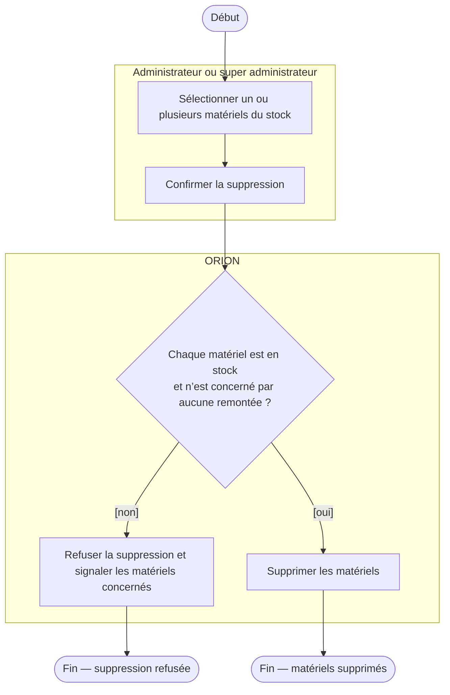
```mermaid
flowchart TD
    debut(["Début"])
    fin(["Fin — matériels supprimés"])
    finRefus(["Fin — suppression refusée"])

    subgraph ACTEUR["Administrateur ou super administrateur"]
        selectionner["Sélectionner un ou plusieurs matériels du stock"]
        confirmer["Confirmer la suppression"]
    end

    subgraph SYSTEME["ORION"]
        controle{"Chaque matériel est en stock<br/>et n’est concerné par aucune remontée ?"}
        refuser["Refuser la suppression et signaler les matériels concernés"]
        supprimer["Supprimer les matériels"]
    end

    debut --> selectionner --> confirmer --> controle
    controle -->|"[non]"| refuser --> finRefus
    controle -->|"[oui]"| supprimer --> fin
```

## 6. Installer une salle

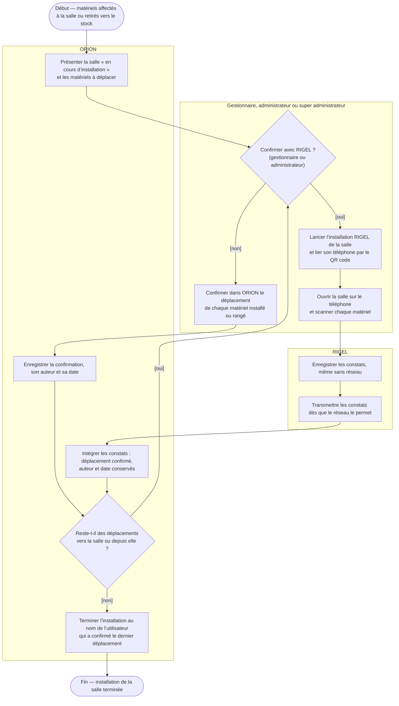
```mermaid
flowchart TD
    debut(["Début — matériels affectés à la salle ou retirés vers le stock"])
    fin(["Fin — installation de la salle terminée"])

    subgraph GESTIONNAIRE["Gestionnaire, administrateur ou super administrateur"]
        mode{"Confirmer avec RIGEL ?<br/>(gestionnaire ou administrateur)"}
        confirmerOrion["Confirmer dans ORION le déplacement<br/>de chaque matériel installé ou rangé"]
        lier["Lancer l’installation RIGEL de la salle<br/>et lier son téléphone par le QR code"]
        scanner["Ouvrir la salle sur le téléphone<br/>et scanner chaque matériel"]
    end

    subgraph RIGEL["RIGEL"]
        constater["Enregistrer les constats, même sans réseau"]
        transmettre["Transmettre les constats dès que le réseau le permet"]
    end

    subgraph SYSTEME["ORION"]
        enCours["Présenter la salle « en cours d’installation »<br/>et les matériels à déplacer"]
        integrer["Intégrer les constats : déplacement confirmé,<br/>auteur et date conservés"]
        enregistrer["Enregistrer la confirmation, son auteur et sa date"]
        reste{"Reste-t-il des déplacements<br/>vers la salle ou depuis elle ?"}
        terminer["Terminer l’installation au nom de l’utilisateur<br/>qui a confirmé le dernier déplacement"]
    end

    debut --> enCours --> mode
    mode -->|"[non]"| confirmerOrion --> enregistrer --> reste
    mode -->|"[oui]"| lier --> scanner --> constater --> transmettre --> integrer --> reste
    reste -->|"[oui]"| mode
    reste -->|"[non]"| terminer --> fin
```

## 7. Recenser le parc

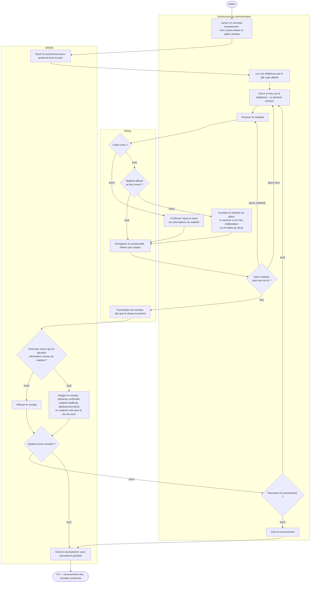
```mermaid
flowchart TD
    debut(["Début"])
    fin(["Fin — recensement clos, constats conservés"])

    subgraph GESTIONNAIRE["Gestionnaire ou administrateur"]
        lancer["Lancer un nouveau recensement :<br/>nom, école entière ou salles choisies"]
        lier["Lier son téléphone par le QR code affiché"]
        ouvrir["Ouvrir un lieu sur le téléphone : s’y déclarer présent"]
        scanner["Scanner un matériel"]
        inconnuSaisie["Confirmer l’ajout et saisir<br/>les informations du matériel"]
        ailleurs["Accepter le matériel sur place,<br/>le ramener à son lieu d’affectation<br/>ou le mettre au stock"]
        suite{"Autre matériel,<br/>autre lieu ou fin ?"}
        poursuivre{"Poursuivre le recensement ?"}
        clore["Clore le recensement"]
    end

    subgraph RIGEL["RIGEL"]
        connu{"Code connu ?"}
        place{"Matériel affecté<br/>au lieu ouvert ?"}
        constat["Enregistrer le constat daté, même sans réseau"]
        transmettre["Transmettre les constats dès que le réseau le permet"]
    end

    subgraph SYSTEME["ORION"]
        ouvrirRecensement["Ouvrir le recensement pour quatorze jours au plus"]
        recent{"Scan plus récent que la dernière<br/>information connue du matériel ?"}
        refuser["Refuser le constat"]
        integrer["Intégrer le constat : présence confirmée,<br/>matériel réaffecté, déplacement lancé<br/>ou matériel créé dans le lieu du scan"]
        echeance{"Quatorze jours écoulés ?"}
        cloture["Clore le recensement, sans réouverture possible"]
    end

    debut --> lancer --> ouvrirRecensement --> lier --> ouvrir --> scanner --> connu
    connu -->|"[non]"| inconnuSaisie --> constat
    connu -->|"[oui]"| place
    place -->|"[oui]"| constat
    place -->|"[non]"| ailleurs --> constat
    constat --> suite
    suite -->|"[autre matériel]"| scanner
    suite -->|"[autre lieu]"| ouvrir
    suite -->|"[fin]"| transmettre --> recent
    recent -->|"[non]"| refuser --> echeance
    recent -->|"[oui]"| integrer --> echeance
    echeance -->|"[non]"| poursuivre
    poursuivre -->|"[oui]"| ouvrir
    poursuivre -->|"[non]"| clore --> cloture
    echeance -->|"[oui]"| cloture --> fin
```

## 8. Créer une remontée

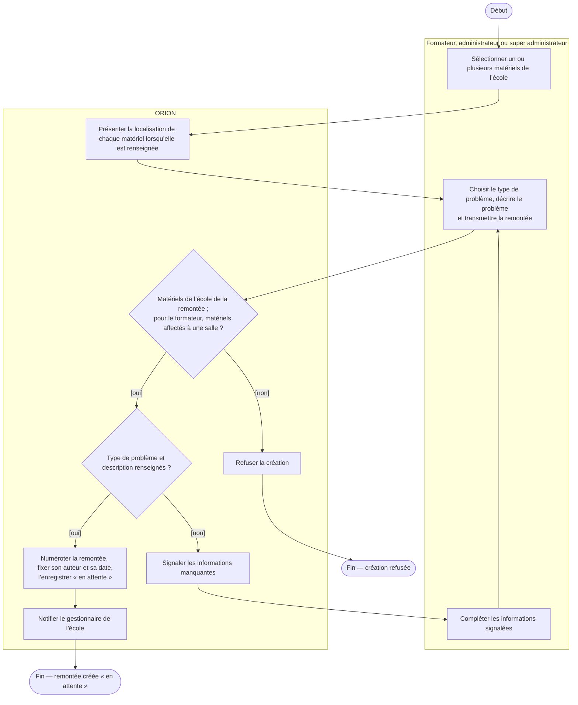
```mermaid
flowchart TD
    debut(["Début"])
    fin(["Fin — remontée créée « en attente »"])
    finRefus(["Fin — création refusée"])

    subgraph ACTEUR["Formateur, administrateur ou super administrateur"]
        selection["Sélectionner un ou plusieurs matériels de l’école"]
        saisie["Choisir le type de problème, décrire le problème<br/>et transmettre la remontée"]
        correction["Compléter les informations signalées"]
    end

    subgraph SYSTEME["ORION"]
        localisation["Présenter la localisation de chaque matériel lorsqu’elle est renseignée"]
        controleAcces{"Matériels de l’école de la remontée ;<br/>pour le formateur, matériels affectés à une salle ?"}
        controleDonnees{"Type de problème et description renseignés ?"}
        erreurs["Signaler les informations manquantes"]
        refus["Refuser la création"]
        enregistrer["Numéroter la remontée, fixer son auteur et sa date,<br/>l’enregistrer « en attente »"]
        notification["Notifier le gestionnaire de l’école"]
    end

    debut --> selection --> localisation --> saisie --> controleAcces
    controleAcces -->|"[non]"| refus --> finRefus
    controleAcces -->|"[oui]"| controleDonnees
    controleDonnees -->|"[non]"| erreurs --> correction --> saisie
    controleDonnees -->|"[oui]"| enregistrer --> notification --> fin
```

## 9. Traiter une remontée

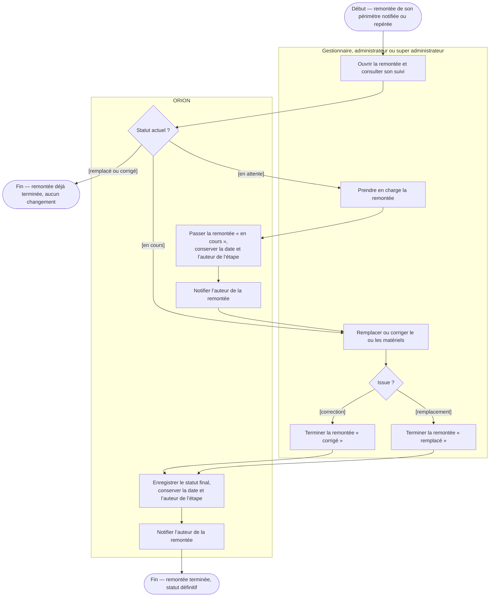
```mermaid
flowchart TD
    debut(["Début — remontée de son périmètre notifiée ou repérée"])
    fin(["Fin — remontée terminée, statut définitif"])
    finRefus(["Fin — remontée déjà terminée, aucun changement"])

    subgraph GESTIONNAIRE["Gestionnaire, administrateur ou super administrateur"]
        ouvrir["Ouvrir la remontée et consulter son suivi"]
        prendre["Prendre en charge la remontée"]
        intervenir["Remplacer ou corriger le ou les matériels"]
        issue{"Issue ?"}
        remplace["Terminer la remontée « remplacé »"]
        corrige["Terminer la remontée « corrigé »"]
    end

    subgraph SYSTEME["ORION"]
        statut{"Statut actuel ?"}
        enCours["Passer la remontée « en cours »,<br/>conserver la date et l’auteur de l’étape"]
        notifierPrise["Notifier l’auteur de la remontée"]
        terminer["Enregistrer le statut final,<br/>conserver la date et l’auteur de l’étape"]
        notifierFin["Notifier l’auteur de la remontée"]
    end

    debut --> ouvrir --> statut
    statut -->|"[en attente]"| prendre --> enCours --> notifierPrise --> intervenir
    statut -->|"[en cours]"| intervenir
    statut -->|"[remplacé ou corrigé]"| finRefus
    intervenir --> issue
    issue -->|"[remplacement]"| remplace --> terminer
    issue -->|"[correction]"| corrige --> terminer
    terminer --> notifierFin --> fin
```

## 10. Consulter ou télécharger le PDF d’état des lieux

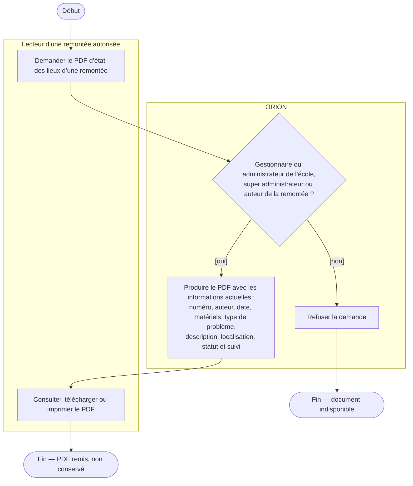
```mermaid
flowchart TD
    debut(["Début"])
    fin(["Fin — PDF remis, non conservé"])
    finRefus(["Fin — document indisponible"])

    subgraph ACTEUR["Lecteur d’une remontée autorisée"]
        demander["Demander le PDF d’état des lieux d’une remontée"]
        lire["Consulter, télécharger ou imprimer le PDF"]
    end

    subgraph SYSTEME["ORION"]
        droit{"Gestionnaire ou administrateur de l’école,<br/>super administrateur ou auteur de la remontée ?"}
        produire["Produire le PDF avec les informations actuelles :<br/>numéro, auteur, date, matériels, type de problème,<br/>description, localisation, statut et suivi"]
        refuser["Refuser la demande"]
    end

    debut --> demander --> droit
    droit -->|"[non]"| refuser --> finRefus
    droit -->|"[oui]"| produire --> lire --> fin
```

## 11. Superviser une salle et arrêter un processus

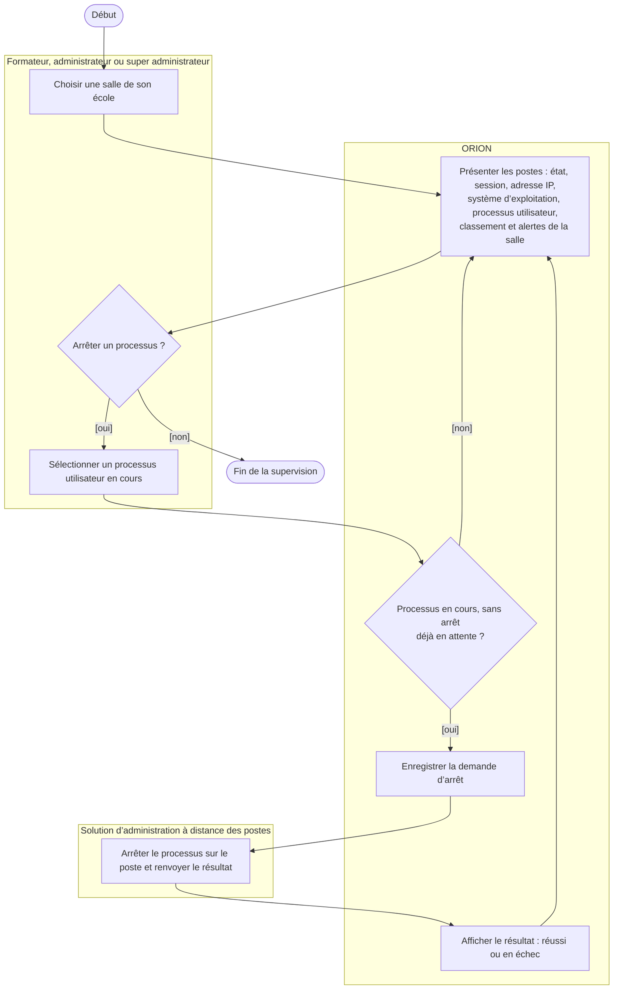
```mermaid
flowchart TD
    debut(["Début"])
    fin(["Fin de la supervision"])

    subgraph ACTEUR["Formateur, administrateur ou super administrateur"]
        choisir["Choisir une salle de son école"]
        decider{"Arrêter un processus ?"}
        selectionner["Sélectionner un processus utilisateur en cours"]
    end

    subgraph SYSTEME["ORION"]
        presenter["Présenter les postes : état, session, adresse IP,<br/>système d’exploitation, processus utilisateur,<br/>classement et alertes de la salle"]
        attente{"Processus en cours, sans arrêt<br/>déjà en attente ?"}
        enregistrer["Enregistrer la demande d’arrêt"]
        afficher["Afficher le résultat : réussi ou en échec"]
    end

    subgraph POSTES["Solution d’administration à distance des postes"]
        arreter["Arrêter le processus sur le poste et renvoyer le résultat"]
    end

    debut --> choisir --> presenter --> decider
    decider -->|"[non]"| fin
    decider -->|"[oui]"| selectionner --> attente
    attente -->|"[non]"| presenter
    attente -->|"[oui]"| enregistrer --> arreter --> afficher --> presenter
```

## 12. Classer les processus et appliquer les règles

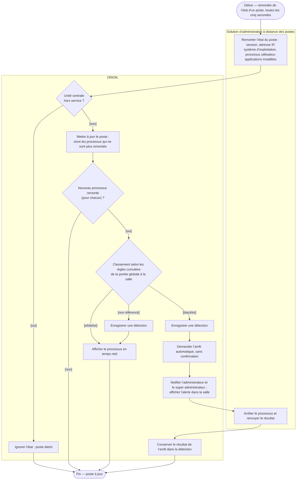
```mermaid
flowchart TD
    debut(["Début — remontée de l’état d’un poste, toutes les cinq secondes"])
    fin(["Fin — poste à jour"])

    subgraph POSTES["Solution d’administration à distance des postes"]
        remonter["Remonter l’état du poste : session, adresse IP,<br/>système d’exploitation, processus utilisateur,<br/>applications installées"]
        arreter["Arrêter le processus et renvoyer le résultat"]
    end

    subgraph SYSTEME["ORION"]
        hs{"Unité centrale<br/>hors service ?"}
        ignorer["Ignorer l’état : poste éteint"]
        mettreAJour["Mettre à jour le poste ;<br/>clore les processus qui ne sont plus remontés"]
        nouveau{"Nouveau processus remonté<br/>(pour chacun) ?"}
        classer{"Classement selon les règles cumulées<br/>de la portée globale à la salle"}
        afficher["Afficher le processus en temps réel"]
        detection["Enregistrer une détection"]
        detectionInterdite["Enregistrer une détection"]
        demander["Demander l’arrêt automatique, sans confirmation"]
        notifier["Notifier l’administrateur et le super administrateur ;<br/>afficher l’alerte dans la salle"]
        conserver["Conserver le résultat de l’arrêt dans la détection"]
    end

    debut --> remonter --> hs
    hs -->|"[oui]"| ignorer --> fin
    hs -->|"[non]"| mettreAJour --> nouveau
    nouveau -->|"[non]"| fin
    nouveau -->|"[oui]"| classer
    classer -->|"[whitelist]"| afficher --> fin
    classer -->|"[non référencé]"| detection --> afficher
    classer -->|"[blacklist]"| detectionInterdite --> demander --> notifier --> arreter --> conserver --> fin
```

## 13. Gérer la whitelist et la blacklist

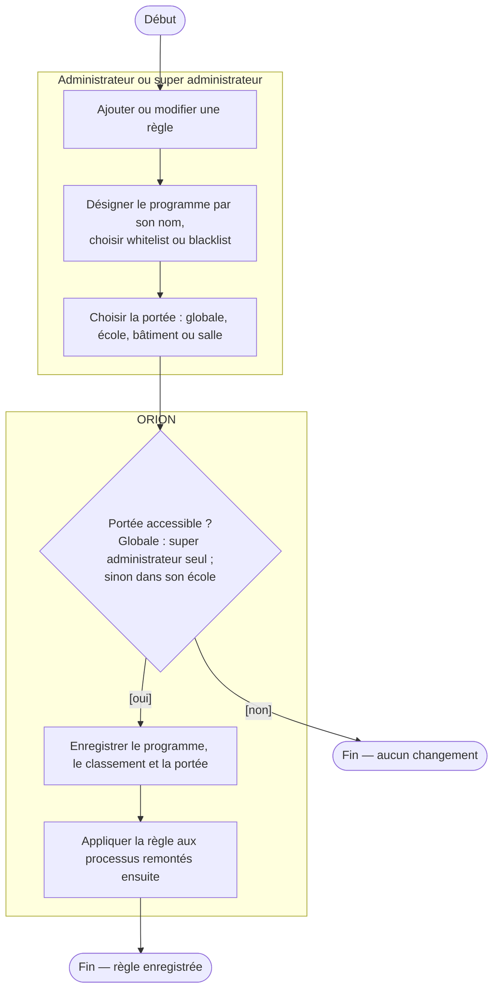
```mermaid
flowchart TD
    debut(["Début"])
    fin(["Fin — règle enregistrée"])
    finRefus(["Fin — aucun changement"])

    subgraph ACTEUR["Administrateur ou super administrateur"]
        demander["Ajouter ou modifier une règle"]
        designer["Désigner le programme par son nom,<br/>choisir whitelist ou blacklist"]
        portee["Choisir la portée : globale, école, bâtiment ou salle"]
    end

    subgraph SYSTEME["ORION"]
        controle{"Portée accessible ?<br/>Globale : super administrateur seul ;<br/>sinon dans son école"}
        enregistrer["Enregistrer le programme, le classement et la portée"]
        appliquer["Appliquer la règle aux processus remontés ensuite"]
    end

    debut --> demander --> designer --> portee --> controle
    controle -->|"[non]"| finRefus
    controle -->|"[oui]"| enregistrer --> appliquer --> fin
```

## 14. Demander une intervention sur les postes

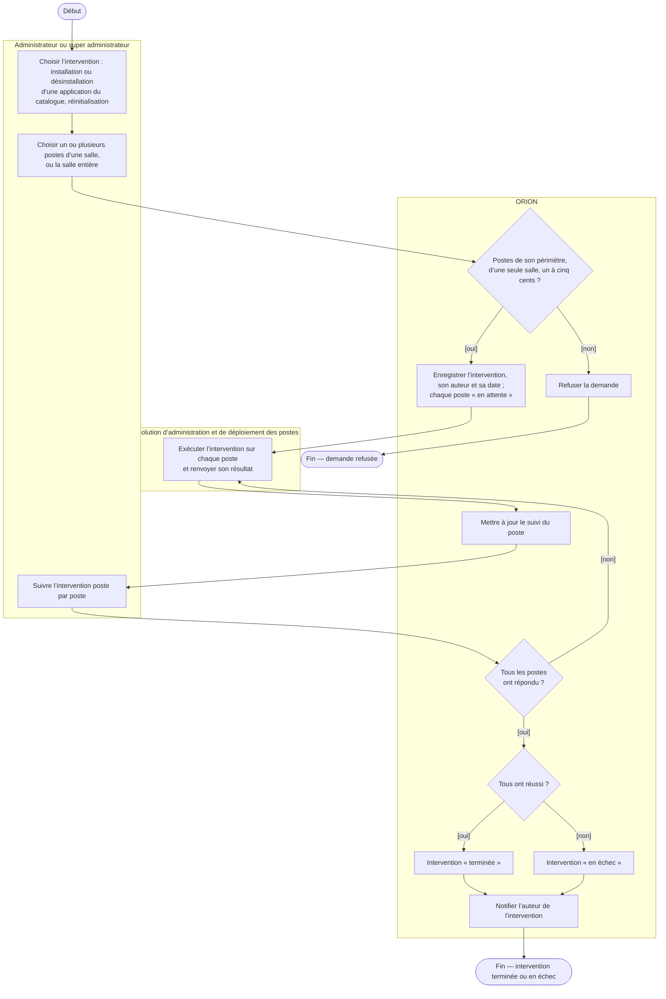
```mermaid
flowchart TD
    debut(["Début"])
    fin(["Fin — intervention terminée ou en échec"])
    finRefus(["Fin — demande refusée"])

    subgraph ACTEUR["Administrateur ou super administrateur"]
        type["Choisir l’intervention : installation ou désinstallation<br/>d’une application du catalogue, réinitialisation"]
        cible["Choisir un ou plusieurs postes d’une salle,<br/>ou la salle entière"]
        suivre["Suivre l’intervention poste par poste"]
    end

    subgraph SYSTEME["ORION"]
        controle{"Postes de son périmètre,<br/>d’une seule salle, un à cinq cents ?"}
        refuser["Refuser la demande"]
        enregistrer["Enregistrer l’intervention, son auteur et sa date ;<br/>chaque poste « en attente »"]
        resultat["Mettre à jour le suivi du poste"]
        reponses{"Tous les postes<br/>ont répondu ?"}
        etat{"Tous ont réussi ?"}
        terminee["Intervention « terminée »"]
        echec["Intervention « en échec »"]
        notifier["Notifier l’auteur de l’intervention"]
    end

    subgraph POSTES["Solution d’administration et de déploiement des postes"]
        executer["Exécuter l’intervention sur chaque poste<br/>et renvoyer son résultat"]
    end

    debut --> type --> cible --> controle
    controle -->|"[non]"| refuser --> finRefus
    controle -->|"[oui]"| enregistrer --> executer --> resultat --> suivre --> reponses
    reponses -->|"[non]"| executer
    reponses -->|"[oui]"| etat
    etat -->|"[oui]"| terminee --> notifier
    etat -->|"[non]"| echec --> notifier
    notifier --> fin
```

## 15. Gérer les salles et les étages

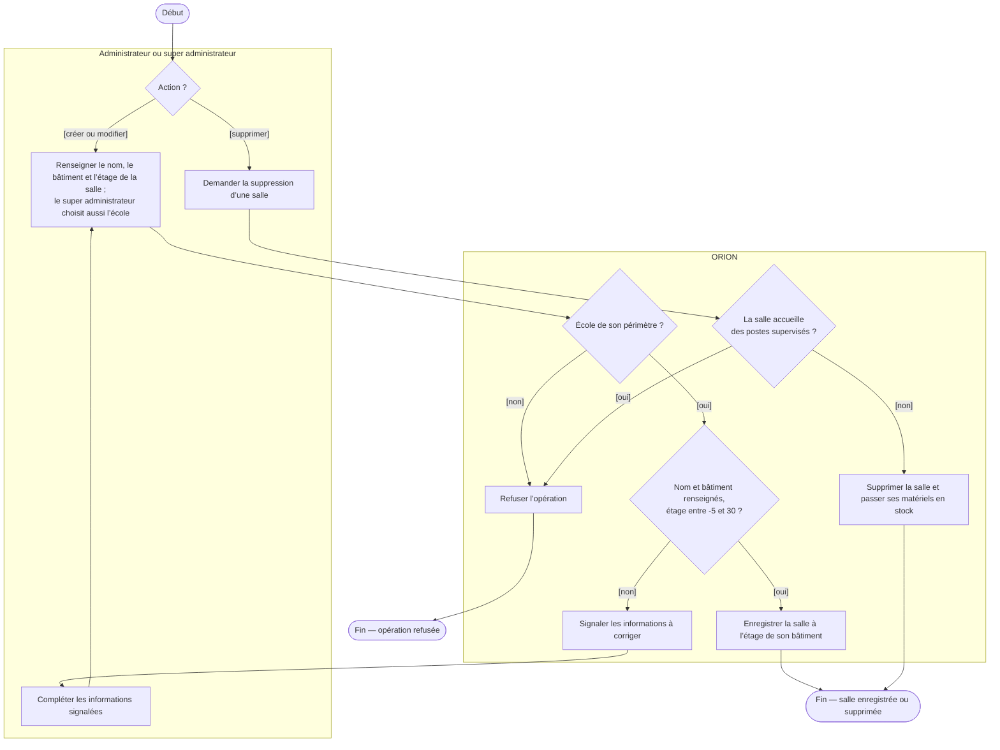
```mermaid
flowchart TD
    debut(["Début"])
    fin(["Fin — salle enregistrée ou supprimée"])
    finRefus(["Fin — opération refusée"])

    subgraph ACTEUR["Administrateur ou super administrateur"]
        action{"Action ?"}
        saisie["Renseigner le nom, le bâtiment et l’étage de la salle ;<br/>le super administrateur choisit aussi l’école"]
        supprimer["Demander la suppression d’une salle"]
        correction["Compléter les informations signalées"]
    end

    subgraph SYSTEME["ORION"]
        controleEcole{"École de son périmètre ?"}
        controleNom{"Nom et bâtiment renseignés,<br/>étage entre -5 et 30 ?"}
        signaler["Signaler les informations à corriger"]
        enregistrer["Enregistrer la salle à l’étage de son bâtiment"]
        postes{"La salle accueille<br/>des postes supervisés ?"}
        refuser["Refuser l’opération"]
        stock["Supprimer la salle et passer ses matériels en stock"]
    end

    debut --> action
    action -->|"[créer ou modifier]"| saisie --> controleEcole
    controleEcole -->|"[non]"| refuser --> finRefus
    controleEcole -->|"[oui]"| controleNom
    controleNom -->|"[non]"| signaler --> correction --> saisie
    controleNom -->|"[oui]"| enregistrer --> fin
    action -->|"[supprimer]"| supprimer --> postes
    postes -->|"[oui]"| refuser
    postes -->|"[non]"| stock --> fin
```

## 16. Créer ou modifier un compte ORION

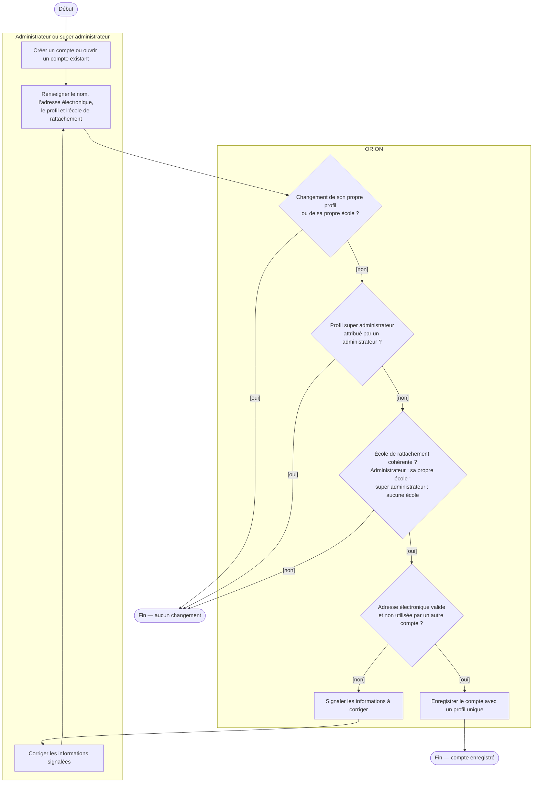
```mermaid
flowchart TD
    debut(["Début"])
    fin(["Fin — compte enregistré"])
    finRefus(["Fin — aucun changement"])

    subgraph ACTEUR["Administrateur ou super administrateur"]
        choisir["Créer un compte ou ouvrir un compte existant"]
        saisir["Renseigner le nom, l’adresse électronique,<br/>le profil et l’école de rattachement"]
        corriger["Corriger les informations signalées"]
    end

    subgraph SYSTEME["ORION"]
        propre{"Changement de son propre profil<br/>ou de sa propre école ?"}
        superAdmin{"Profil super administrateur<br/>attribué par un administrateur ?"}
        ecole{"École de rattachement cohérente ?<br/>Administrateur : sa propre école ;<br/>super administrateur : aucune école"}
        adresse{"Adresse électronique valide<br/>et non utilisée par un autre compte ?"}
        signaler["Signaler les informations à corriger"]
        enregistrer["Enregistrer le compte avec un profil unique"]
    end

    debut --> choisir --> saisir --> propre
    propre -->|"[oui]"| finRefus
    propre -->|"[non]"| superAdmin
    superAdmin -->|"[oui]"| finRefus
    superAdmin -->|"[non]"| ecole
    ecole -->|"[non]"| finRefus
    ecole -->|"[oui]"| adresse
    adresse -->|"[non]"| signaler --> corriger --> saisir
    adresse -->|"[oui]"| enregistrer --> fin
```

## 17. Désactiver ou réactiver un compte ORION

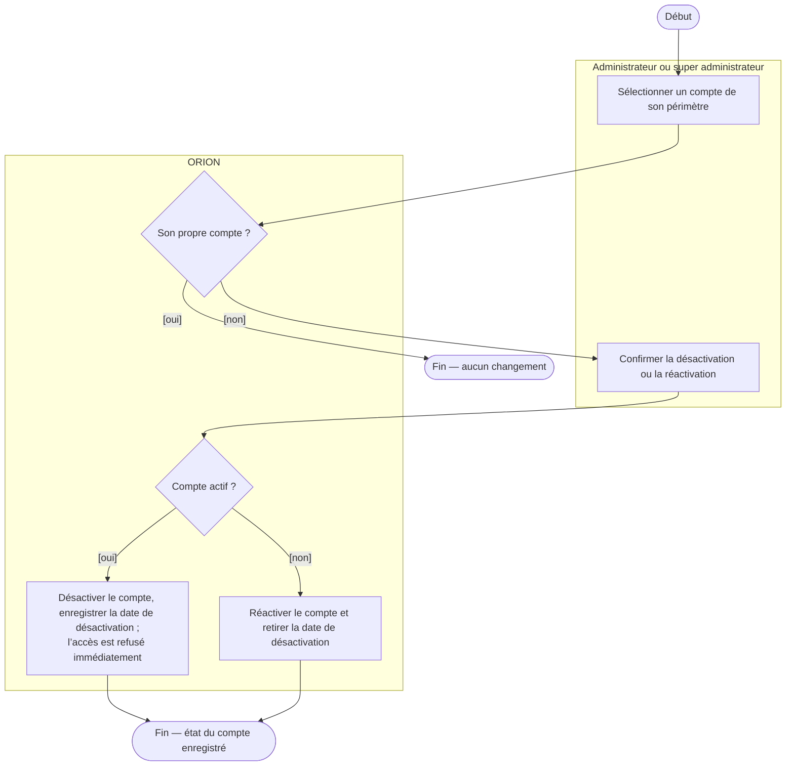
```mermaid
flowchart TD
    debut(["Début"])
    fin(["Fin — état du compte enregistré"])
    finRefus(["Fin — aucun changement"])

    subgraph ACTEUR["Administrateur ou super administrateur"]
        selectionner["Sélectionner un compte de son périmètre"]
        confirmer["Confirmer la désactivation ou la réactivation"]
    end

    subgraph SYSTEME["ORION"]
        propre{"Son propre compte ?"}
        etat{"Compte actif ?"}
        desactiver["Désactiver le compte, enregistrer la date de désactivation ;<br/>l’accès est refusé immédiatement"]
        reactiver["Réactiver le compte et retirer la date de désactivation"]
    end

    debut --> selectionner --> propre
    propre -->|"[oui]"| finRefus
    propre -->|"[non]"| confirmer --> etat
    etat -->|"[oui]"| desactiver --> fin
    etat -->|"[non]"| reactiver --> fin
```

## 18. Créer ou renommer une école

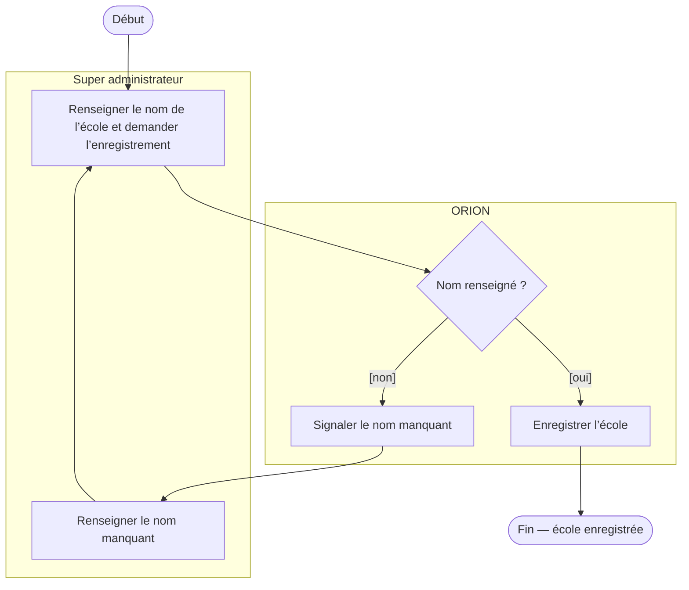
```mermaid
flowchart TD
    debut(["Début"])
    fin(["Fin — école enregistrée"])

    subgraph ACTEUR["Super administrateur"]
        saisie["Renseigner le nom de l’école et demander l’enregistrement"]
        correction["Renseigner le nom manquant"]
    end

    subgraph SYSTEME["ORION"]
        nomPresent{"Nom renseigné ?"}
        erreurs["Signaler le nom manquant"]
        enregistrer["Enregistrer l’école"]
    end

    debut --> saisie --> nomPresent
    nomPresent -->|"[non]"| erreurs --> correction --> saisie
    nomPresent -->|"[oui]"| enregistrer --> fin
```

## 19. Personnaliser ses tableaux de bord

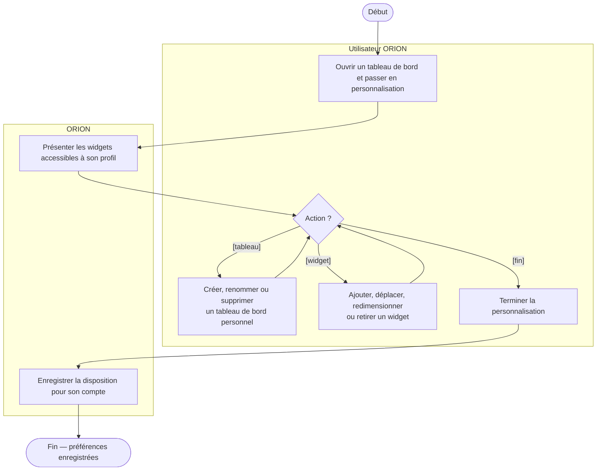
```mermaid
flowchart TD
    debut(["Début"])
    fin(["Fin — préférences enregistrées"])

    subgraph UTILISATEUR["Utilisateur ORION"]
        ouvrir["Ouvrir un tableau de bord et passer en personnalisation"]
        action{"Action ?"}
        ajouterTableau["Créer, renommer ou supprimer<br/>un tableau de bord personnel"]
        widget["Ajouter, déplacer, redimensionner<br/>ou retirer un widget"]
        terminer["Terminer la personnalisation"]
    end

    subgraph SYSTEME["ORION"]
        presenter["Présenter les widgets accessibles à son profil"]
        enregistrer["Enregistrer la disposition pour son compte"]
    end

    debut --> ouvrir --> presenter --> action
    action -->|"[tableau]"| ajouterTableau --> action
    action -->|"[widget]"| widget --> action
    action -->|"[fin]"| terminer --> enregistrer --> fin
```
