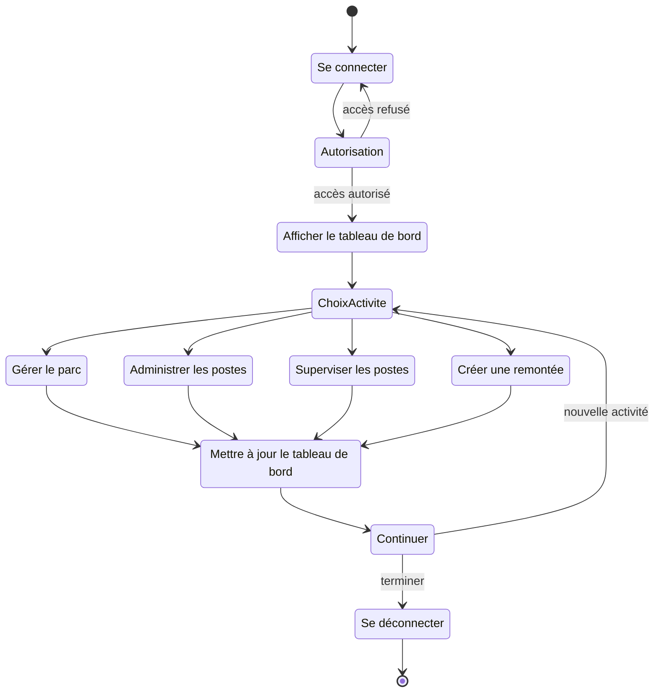

# Diagramme d'activité de l'application ASTER

```mermaid
stateDiagram-v2
    direction TB

    [*] --> Connexion
    Connexion --> Autorisation

    state Autorisation <<choice>>
    Autorisation --> Connexion : accès refusé
    Autorisation --> TableauBord : accès autorisé

    TableauBord --> ChoixActivite
    state ChoixActivite <<choice>>

    ChoixActivite --> GererParc
    ChoixActivite --> AdministrerPostes
    ChoixActivite --> SuperviserPostes
    ChoixActivite --> CreerRemontee

    GererParc --> Restitution
    AdministrerPostes --> Restitution
    SuperviserPostes --> Restitution
    CreerRemontee --> Restitution

    Restitution --> Continuer

    state Continuer <<choice>>
    Continuer --> ChoixActivite : nouvelle activité
    Continuer --> Deconnexion : terminer
    Deconnexion --> [*]

    state "Se connecter" as Connexion
    state "Afficher le tableau de bord" as TableauBord
    state "Gérer le parc" as GererParc
    state "Administrer les postes" as AdministrerPostes
    state "Superviser les postes" as SuperviserPostes
    state "Créer une remontée" as CreerRemontee
    state "Mettre à jour le tableau de bord" as Restitution
    state "Se déconnecter" as Deconnexion
```
