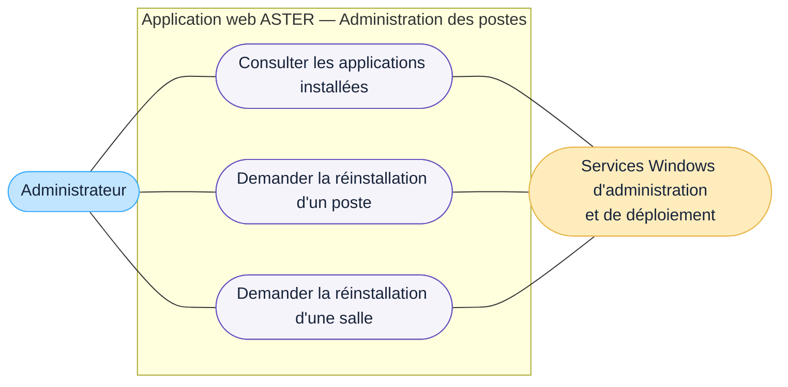

# DCU — Administrer les postes

```mermaid
flowchart LR
    administrateur(["Administrateur"])

    subgraph aster["Application web ASTER — Administration des postes"]
        direction TB
        consulterApplications(["Consulter les applications installées"])
        demanderPoste(["Demander la réinstallation d'un poste"])
        demanderSalle(["Demander la réinstallation d'une salle"])
    end

    servicesWindows(["Services Windows d'administration<br/>et de déploiement"])

    administrateur --- consulterApplications
    administrateur --- demanderPoste
    administrateur --- demanderSalle

    consulterApplications --- servicesWindows
    demanderPoste --- servicesWindows
    demanderSalle --- servicesWindows

    classDef acteur fill:#C2E5FF,stroke:#3DADFF,color:#17243B
    classDef acteurSecondaire fill:#FFECBD,stroke:#E8B84E,color:#17243B
    classDef cas fill:#F6F4FB,stroke:#6954C0,color:#17243B
    class administrateur acteur
    class servicesWindows acteurSecondaire
    class consulterApplications,demanderPoste,demanderSalle cas
```
